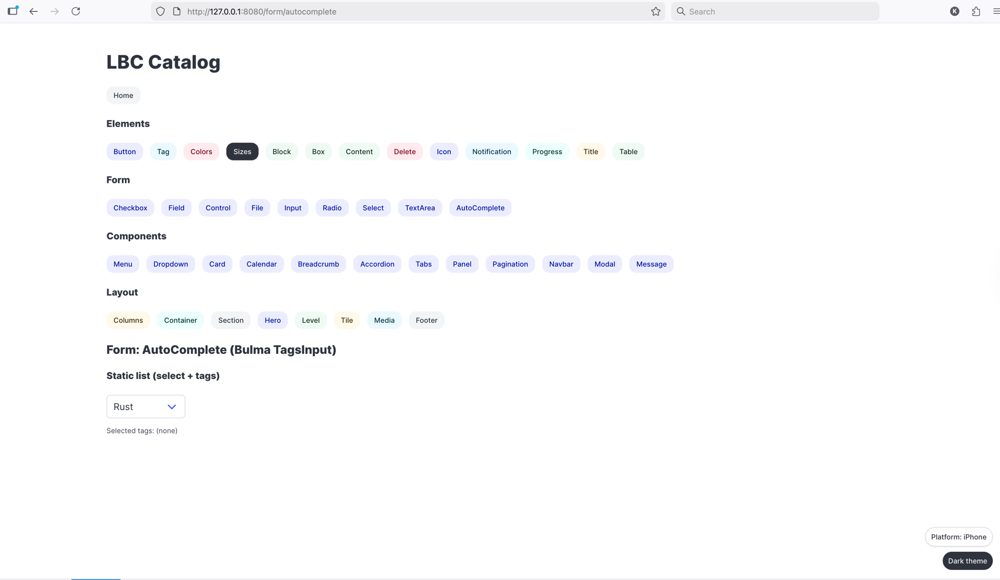

# LBC — Leptos Bulma Components

LBC is a collection of reusable, declarative UI components for the Leptos web framework, styled with the Bulma CSS library. The goal is to provide ergonomic, type‑safe components that feel natural in Leptos while mapping closely to Bulma’s design system and ecosystem.

## Motivation
- Build production‑ready, Bulma‑based components that are fully compatible with Leptos (client‑side rendering first).
- Offer a consistent API surface that mirrors Bulma’s mental model (elements, components, layout, forms).
- Ship a catalog app (`lbc_catalog`) demonstrating usage, patterns, and best practices.

## Repository layout
- `src/` — the `lbc` library crate (this is what you depend on).
- `lbc_catalog/` — a small catalog/demo application showing all components in action (CSR, built with Trunk).
- `dist/`, `target/` — build artifacts (gitignored).

## Quick start (using the catalog)
The catalog is the fastest way to explore the components locally.

Prerequisites:
- Rust toolchain (stable) and `wasm32-unknown-unknown` target
- Trunk (for serving the WASM app)

Install prerequisites:
```
rustup target add wasm32-unknown-unknown
cargo install trunk
```

Run the catalog app:
```
cd lbc_catalog
trunk serve --open
```
This will build the WASM binary and open the catalog in your browser. The catalog includes CDN links for Bulma, Font Awesome, and a few Bulma JS plugins used by some components.

Notes:
- The catalog uses Leptos CSR only (`leptos = { features = ["csr"] }`).
- Trunk picks up `index.html` with `data-trunk` tags to compile and serve the app.

## Use `lbc` in your Leptos app
Add a dependency (use a path dependency locally, or crates.io when published):
```
[dependencies]
leptos = { version = "0.8", features = ["csr"] }
lbc = { git= "https://github.com/goodidea-kp/lbc" } # in the catalog; in your app, use the appropriate path or version
```

Import the prelude to get the most commonly used components and helpers:
```
use lbc::prelude::*;
```

Example: a simple Card with Content
```
use leptos::*;
use lbc::prelude::*;

#[component]
pub fn ExampleCard() -> impl IntoView {
    view! {
        <Card>
            <CardHeader>"My header"</CardHeader>
            <CardImage>
                <figure class="image is-4by3">
                    
                </figure>
            </CardImage>
            <CardContent>
                <Content>
                    <p>"Hello from LBC!"</p>
                </Content>
            </CardContent>
            <CardFooter>
                <a class="card-footer-item">"Action"</a>
            </CardFooter>
        </Card>
    }
}
```

## What gets re‑exported via `lbc::prelude`
The prelude consolidates the most frequently used items across elements, components, layout, and forms so you can `use lbc::prelude::*;` and start building.

- Components:
  - `Tabs`, `Alignment`
  - `Panel`, `PanelBlock`, `PanelTabs`
  - `Pagination`, `PaginationItem`, `PaginationItemType`, `PaginationEllipsis`
  - `Navbar`, `NavbarItem`, `NavbarDropdown`, `NavbarDivider`, `NavbarFixed`, `NavbarMenuContext`
  - `Modal`, `ModalCard`, `ModalCloserProvider`, `ModalCloserContext`
  - `Message`, `MessageHeader`, `MessageBody`
  - `Menu`, `MenuLabel`, `MenuList`
  - `Dropdown`
  - `Card`, `CardHeader`, `CardImage`, `CardContent`, `CardFooter`
  - `Calendar`
  - `Breadcrumb`, `BreadcrumbSeparator`, `BreadcrumbSize`
  - `Accordions`, `AccordionItem`

- Elements:
  - `Block`, `Box`
  - `Button`, `ButtonColor`, `Buttons`
  - `Content`
  - `Notification`
  - `List`
  - `Delete`
  - `Icon`, `IconAlignment`
  - `Image`
  - `Progress`
  - `Table`
  - `Tag`, `TagColor`, `Tags`
  - `Title`, `Subtitle`, `HeaderSize`

- Layout:
  - `Columns`, `Column`, `ColumnSize`
  - `Container`
  - `Footer`
  - `Hero`, `HeroSize`
  - `Level`, `LevelLeft`, `LevelRight`, `LevelItem`
  - `Media`, `MediaLeft`, `MediaRight`, `MediaContent`
  - `Section`, `SectionSize`
  - `Tile`, `TileSize`, `TileCtx`

- Form (controlled components):
  - `Field` (with `LabelSize`, `GroupedAlign`, `AddonsAlign`)
  - `Control`
  - `Input`, `InputType`
  - `Textarea`
  - `Select`, `MultiSelect`
  - `Checkbox`
  - `Radio`
  - `File`
  - `AutoComplete`

- Utilities:
  - `Size` (shared sizing utility)

Tip: See `src/lib.rs` and the module `mod.rs` files for the exact public surface and newly added items.

## Using Bulma and related JS plugins
LBC components assume Bulma CSS is available globally. The catalog’s `index.html` shows a working baseline:
- Bulma CSS from CDN
- Font Awesome for icons
- Optional third‑party Bulma plugins used by some components:
  - `bulma-calendar`
  - `@creativebulma/bulma-tagsinput`
  - `bulma-accordion`

You can include these via CDN or bundle them yourself. If your app doesn’t require a given plugin, you can omit it.

## Running example pages in the catalog
The catalog includes many example pages under `lbc_catalog/src/`, e.g.:
- `components/accordion_example_page.rs`
- `components/breadcrumb_example_page.rs`
- `components/buttons_example_page.rs`
- `components/calendar_example_page.rs`
- `components/card_example_page.rs`
- `components/dropdown_example_page.rs`
- `elements/content_example_page.rs`
- `elements/colors_example_page.rs`
- `footer_example_page.rs`, `level_example_page.rs`, etc.



Explore the code there for end‑to‑end snippets of real usage.

## Development workflow
- Regular Rust code for components (no macros beyond Leptos #[component]).
- Prefer small, focused modules mirroring Bulma’s structure.
- Form components are controlled: state is held by the parent and passed via signals/props.
- For local development, run the catalog with Trunk and iterate.


## License
Specify your chosen license here (e.g., MIT/Apache‑2.0 dual license). Add LICENSE file accordingly.

## Acknowledgements
- Leptos for the reactive UI framework
- Bulma for the CSS framework
- Community Bulma plugins used in examples
